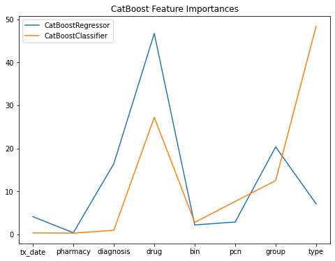

	
<h2>Welcome</h2>
		
		
My name is Andy Huynh. I am currently a Ph.D. student at Rutgers University interested in low dimensional topology. In my spare time, you might see me <a href="img/IMG_20210930_201750.jpg">building Legos</a>, tinkering with some electronics, or rock climbing. Here are some projects I worked on in the past.

	

	
	

	

 

## Project 1: [Ubiquant Market Prediction](https://github.com/andyhuynh92/Ubiquant-Comp)

Collaborating with [Professor Lei Yu](https://alcoholstudies.rutgers.edu/people/faculty/lei-yu/) and members of his laboratory, we participated in a [Kaggle competition hosted by Ubiquant](https://www.kaggle.com/competitions/ubiquant-market-prediction), a hedge fund located in China. 

### Goal: 

The goal is to use the given data containing a `time_id`, `investment_id`, and 300 features to predict `target`. We know that the `target` is based off of a stock's rate of return, i.e., daily percent change. How they measure how submitted models perform is to find the mean of Pearson correlation between our predictions to the true values at each `time_id`. 

### Data Description: 

The data given is completely anonymized. That means
- All 300 features are anonymized. 
- Both time of the investment and the stock are anonymized. 
- The target is anonymized. 
In addition, we found out that the data has been additionally processed. In particular, fixing a value for a `time_id`, we found out that most of the time(but not all), the feature will have approximately mean 0 and standard deviation 1.

	

### Analysis:

From the public discussion boards, people were able to reverse engineer both `time_id` and `investment_id`, figuring out the real time correspondence for `time_id`, and the likely stock tickers corresponding to each `investment_id`. Using this data, we grabbed the stock data using the Yahoo! finance API and ran correlations between the stock price and the features. We discovered that the features and target are both detrended and normalized at each `time_id`, i.e., the features and target have mean 0 and standard deviation 1, making it difficult to reverse engineer the existing features and feature engineer new ones.

The competition allows us to submit two models. Our first model used LightGBM. Our second model is an ensemble of LightGBM with a deep neural network.

### Follow up, JPX Kaggle Competition(Currently ongoing and WIP)

Continuing from the Ubiquant Kaggle competition above, we decided to work on another [Kaggle competition hosted by JPX](https://www.kaggle.com/competitions/jpx-tokyo-stock-exchange-prediction), the parent company of the Tokyo stock exchange. The goal of this competition is to rank the stocks in the Tokyo stock market and get the highest competition metric, based on the [Sharpe ratio.](https://en.wikipedia.org/wiki/Sharpe_ratio)

## Project 2: [CoverMyMeds project](https://github.com/andyhuynh92/CMM-Team-Ranger)

This is a group project done during the Erdos Institute bootcamp in 2022, with 3 other team members.

### Goal:

Use the provided data for 3 goals:
1. Predict the copay of a prescribed medication 
2. Find out the formulary status of a drug(i.e., the preference of the drug as considered by insurance)
3. Provide substitutions in the case when copay is expensive or even rejected by insurance

### Data:

The data is simulated drug data(for legality reasons), with features containing date, pharmacy, diagnosis, drug, and three indicators of insurance. The data is also anonymized, as the diagnosis, drug, and insurance information do not correspond to real life objects. From here, we are also provided if insurance covered the drug, and if they did, how much the patient copay is.

### Analysis:

Initial analysis showed that insurance is 30\% more likely to reject covering a drug if the drug is a brand-name drug instead of a generic drug. From there, we know that the copay is most influenced by the drug itself and the insurance that the patient has. For drug with the most expensive copay, we found that most patients are either paying $15 or $500. Two of the three indicators of insrunace are able to separate these low paying patients from high paying patients, controlling all other factors. 

Since most of the features are categorical, we have decided to use CatBoost as our model. We also considered using random forests, but it was too slow for our purposes. Our model used two steps. We first predicted whether or not a drug will be accepted by insurance. From there, we predict the copay of the drug if it is covered by insurance. Looking at the feature importances given by CatBoost after fitting the models, we see that the important features are exactly what we found earlier, showing that this model is heading towards the right direction.

	

Additionally, we also sought to find out the formulary status of a drug. We used the conditions:
- cheapest 
- lowest rejection
- and most prescribed drug,
controlling for other factors. We found drugs that best satisfies these conditions and worst satisfied these condtions, interpolating every other possibility inbetween. This created a list of substition drugs that we can recommend. On average, this saves $20.50 by choosing the best(accoring to the conditions above) drug over a randomly chosen drug. The greatest savings we found was $241.55.

## Project 3: [Root Insurance project](https://github.com/gedwards09/Root-it)

This is a group project done during the Erdos Institute bootcamp in 2021, with 4 other team members.

### Goal:

The data contains information of customers who were presented advertisements from five insurance agencies, including the client, Root Insurance. Each insurance company "bids" for the placement of their advertisement for each customer, and the ads are shown to the customer in order from highest to lowest bidder. The customer can then choose to click any ad shown and can purchase a policy from any ad they click. The client has been using a flat \$10 bid strategy for all customers and wants to use the data collected to optimize the efficiency of customer acquisition in future. Our goal is to introduce a bidding strategy that produces the most customers per dollar, with the additional constraint of guaranteeing at least 400 customers per 10,000.

### Data:

Root Insurance provided information on 10,000 customers including their information: current insurance status (insured, uninsured, or unknown), marital status (married, single), number of drivers (one, two, or three+), and number of vehicles (one or two+); whether the customer clicked the client's as; and whether the customer ultimately purchased a policy from the client. Root Insurance used a flat \$10 bid for all of these customers, which determined the placement of the ad.

### Analysis:

We wanted to compute both expected sales and expected cost with our bids, which required us to model a price of bid to probability of sale using a probability distribution. We experimented with both a uniform distribution and an exponential distribution, eventually deciding to assume our bids follow a uniform distribution with exponential tails. This assumption allows us to model an expected cost function and expected number of policies sold. We also require(from the client) a constraint that requires the expected number of policies sold to be at least 400. 

	

We attempted to optimize expected cost constrained to the expected number of policies sold using two methods:
- Using the SciPy package for constrained minimization,
- Performing gradient descent with a barrier function.

Analyzing the minimization, we have found out what traits are highly desired by other companies, and we bid contrary to the competitors, seeking out less desired candidates. This means that we bid higher when our competition bids low, and vice versa. 
